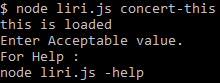

# LIRI-node-app

**LIRI** is like iPhone's **SIRI**. However, while **SIRI** is a Speecg Interpretatiot and Recognition Interface, **LIRI** is a Language Interpretation and Recognation Interface. 

**LIRI** is command line node app that takes in command and parameter and gives you back data.

In **LIRI** I used :
 - **Axios** module
    - For getting response from spesific URL.
    
 - **FS** module
    - For reading and writing informations on external txt file.
    
 - **Spotify-Node** module
    - For searching spesific responce from spotify
    
 - **Moment Js** module
    - For formating date values.
    
 - **dotenv** module
    - For hiding keys, passwords and client IDs.
    

In **LIRI** there are simple 5 command: 

## **-Help**

This command is classic help command. The command show the user that what commands is avaible on LIRI bot.

If user write unsensable command, LIRI offer them to using -help.

Also while user searching something without a paramater or gibirish paramater LIRI offer help again.

## **Spotify-this-song**

This command helps the user to find music information from spotify. If user want to listen a music and know only 2-3 word from lyrics, LIRI can help them!.

This command accept 1 or more search term. for exp umbrella or black eyed peas or taylor swift or Billie Eilish.

This command gives Artist name, song album name, song name and spotify play link to user. If user want to listen this song, they can just copy paste and listen. That's simple right!

If user forget the right command or write gibirish something, LIRI offer help.

## **Concert-this**

While you are listening a song, you recognize someting that is boring listening music with your phone or computer. And you want to go out with you GF or BF. You want to listen music in perfect ambiance with real beats. CONCERT! Good idea! LIRI can help you. 

This command helps you to find your favorite artist's concerts. Where and when. 

This command accept 1 or more search term. for exp rihanna or black eyed peas or taylor swift or Billie Eilish.

If you are lucky, your artist is in tour and you can see many result. And LIRI can show you nearest 10 events.

Maybe your artist is on vacation and there is no concert plan of her. LIRI can show you.

If your favorite artist plan only one concert,

If you are so exited and your fingers shaking while writing name of your favorite artist,

